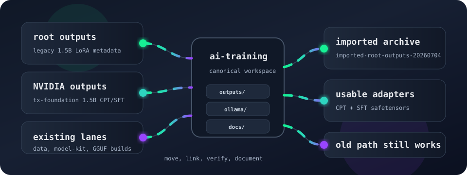

# The July 4 AI Training Consolidation

<p align="center">
  
</p>

This model-kit copy mirrors the root ai-training article so the launch surface
can explain which local adapters, GGUF builds, and imported checkpoints are
available before a train, upload, Ollama, or CAAP registration run.

On 2026-07-04, the local Solana Clawd training tree was consolidated so recent
model work has one operating base: `ai-training`. The goal was simple: keep the
new training outputs, legacy checkpoints, GGUF builds, datasets, and notes in a
single place without breaking old scripts that still reference historical paths.

## What Changed

The root-level output folder was moved into the training workspace:

```bash
/Users/8bit/Downloads/solana-clawd/outputs
  -> /Users/8bit/Downloads/solana-clawd/ai-training/outputs/imported-root-outputs-20260704
```

A compatibility symlink keeps the old path working:

```bash
/Users/8bit/Downloads/solana-clawd/outputs
  -> /Users/8bit/Downloads/solana-clawd/ai-training/outputs/imported-root-outputs-20260704
```

The fresh NVIDIA transaction-foundation 1.5B run was moved from the
`traintoearn` working tree into the model output lane:

```bash
/Users/8bit/Downloads/solana-clawd/ai-training/outputs/solana-tx-foundation-1.5b
```

That run now carries the local CPT and SFT adapter checkpoints in the same
workspace as the rest of the Solana Clawd model family.

## Artifact Inventory

The newly consolidated NVIDIA 1.5B lane includes:

| Path | Role |
|---|---|
| `outputs/solana-tx-foundation-1.5b/cpt/adapter_model.safetensors` | CPT adapter export |
| `outputs/solana-tx-foundation-1.5b/cpt/checkpoint-140/adapter_model.safetensors` | CPT checkpoint |
| `outputs/solana-tx-foundation-1.5b/sft/checkpoint-500/adapter_model.safetensors` | Mid-run SFT checkpoint |
| `outputs/solana-tx-foundation-1.5b/sft/checkpoint-1000/adapter_model.safetensors` | Latest SFT checkpoint found in the moved run |

The imported legacy folder includes:

```bash
outputs/imported-root-outputs-20260704/solana-clawd-1.5b-lora/checkpoint-3
```

That checkpoint is useful as provenance, but it is not currently runnable:

- It has `adapter_config.json`, `chat_template.jinja`, and README metadata.
- It does not include `adapter_model.safetensors`, `adapter_model.bin`, or
  `adapter_model.gguf`.
- Its `tokenizer.json` is zero bytes.
- Its base model is `Qwen/Qwen2.5-1.5B-Instruct`, so it must not be attached to
  the Nemotron GGUF server path.

## What Was Already In Place

The scan confirmed these lanes were already present in `ai-training` and did not
need duplicate copies:

- `data/` and `data/model_kit/`
- `model-kit/`
- `ollama/build/solana-clawd-core-ai-1.5b-Q4_K_M.gguf`
- `ollama/build/solana-trading-factory-8b-Q4_K_M.gguf`
- `ollama/deepsol-clawd-code-q8.gguf`
- existing full and adapter outputs under `outputs/`

## Current Operating Rule

Use `ai-training` as the canonical workspace for model artifacts. Old paths may
remain as compatibility links, but new train/eval/export outputs should land
under one of these lanes:

```bash
data/
outputs/
ollama/
wandb/
docs/
```

That keeps local training, model cards, Hub release bundles, Ollama builds, and
runtime notes close enough that future launches can be audited without searching
the whole machine.

## Next Useful Step

Promote the usable NVIDIA 1.5B checkpoints into a formal README/model-card lane:

```bash
outputs/solana-tx-foundation-1.5b/README.md
```

The card should record base model, dataset, CPT/SFT split, train args, adapter
status, and the intended merge/export path before any Hub or Ollama release.
